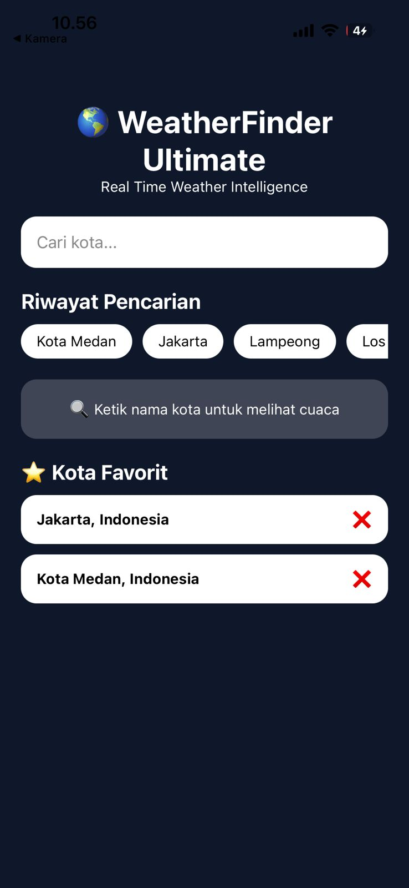

# WeatherFinder Ultimate

## Deskripsi

WeatherFinder Ultimate adalah aplikasi cuaca berbasis React Native dan Expo yang menggunakan Open-Meteo API untuk menampilkan informasi cuaca secara real-time dari berbagai kota di dunia.

Aplikasi ini menerapkan konsep React Hooks khususnya useEffect, debounce search, AbortController, dan integrasi REST API dua langkah (Geocoding → Forecast).

---

## Fitur Level 1 (Wajib)

* Search kota dengan TextInput
* Controlled Component
* Debounce 500ms
* useEffect dengan dependency array
* Fetch API 2 langkah (Geocoding → Forecast)
* Loading State
* Error State
* Success State
* Empty State
* AbortController Cleanup Function
* Mapping Weather Code ke Emoji & Label

---

## Fitur Level 2

* Arah Mata Angin (U, TL, T, TG, S, BD, B, BL)
* Forecast Suhu 7 Hari
* Riwayat Pencarian
* Refresh Data Cuaca
* Background Dinamis Berdasarkan Cuaca
* Mode Siang dan Malam

---

## Fitur Level 3

* Multi Kota
* Kota Favorit
* Pull To Refresh
* Animasi Fade In
* FlatList Multi Weather Card

---

## Teknologi yang Digunakan

* React Native
* Expo
* JavaScript
* Open-Meteo API
* React Hooks (useState, useEffect, useRef)

---

## Cara Menjalankan Project

Install dependency:

```bash
npm install
```

Menjalankan aplikasi:

```bash
npx expo start
```

Scan QR Code menggunakan aplikasi Expo Go pada Android atau iOS.

---

## Screenshots

### Empty State


### Loading State


### Success State


### Error State


### Forecast 7 Hari


### Kota Favorit



---

## Struktur Fitur

### Search Kota

Pengguna dapat mencari kota dari seluruh dunia menggunakan Open-Meteo Geocoding API.

### Forecast Cuaca

Menampilkan suhu saat ini, kondisi cuaca, kelembaban, tekanan udara, arah dan kecepatan angin.

### Forecast 7 Hari

Menampilkan suhu maksimum dan minimum selama 7 hari ke depan.

### Riwayat Pencarian

Menyimpan 5 pencarian terakhir untuk akses cepat.

### Kota Favorit

Menyimpan kota favorit yang sering dipantau.

### Multi Kota

Menampilkan beberapa kota sekaligus dalam satu halaman.

---

## API

Geocoding API:

https://geocoding-api.open-meteo.com

Forecast API:

https://api.open-meteo.com

---

## Repository

Author: Muhammad Zaki Atthoriq

Project: WeatherFinder Ultimate
